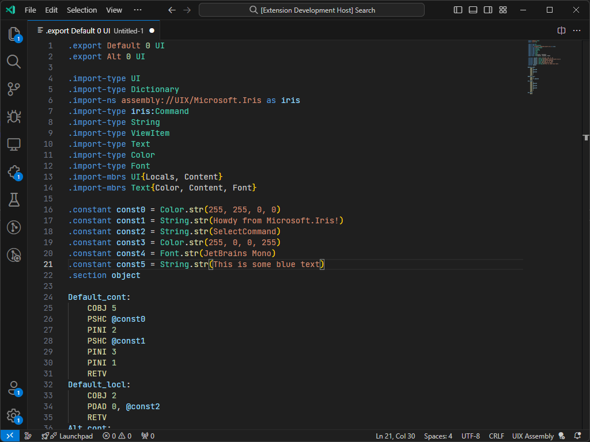

# uixa

This is a Visual Studio Code extension that provides language support (specifically, syntax highlighting) for [UIX Assembly](https://github.com/ZuneDev/ZuneUIXTools/tree/master/libs/UIX.Asm).

## Features

At the moment, syntax highlighting is the only supported feature.

## Installation
UIXA is available from the [VS Code Marketplace](https://marketplace.visualstudio.com/items?itemName=YoshiAsk.uixa) and [GitHub Releases](https://github.com/ZuneDev/vscode-UIXA/releases).

## Requirements
None, just install it and go!
